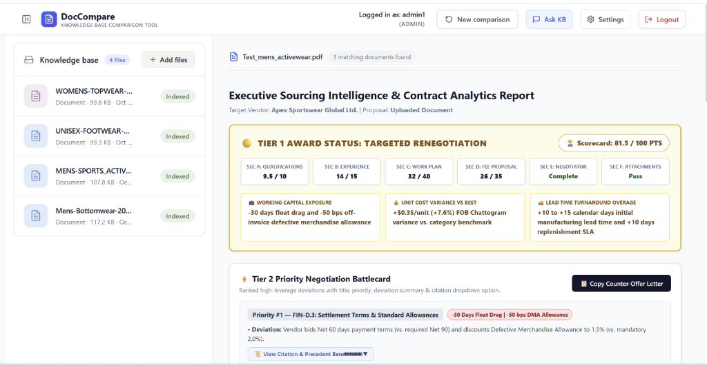
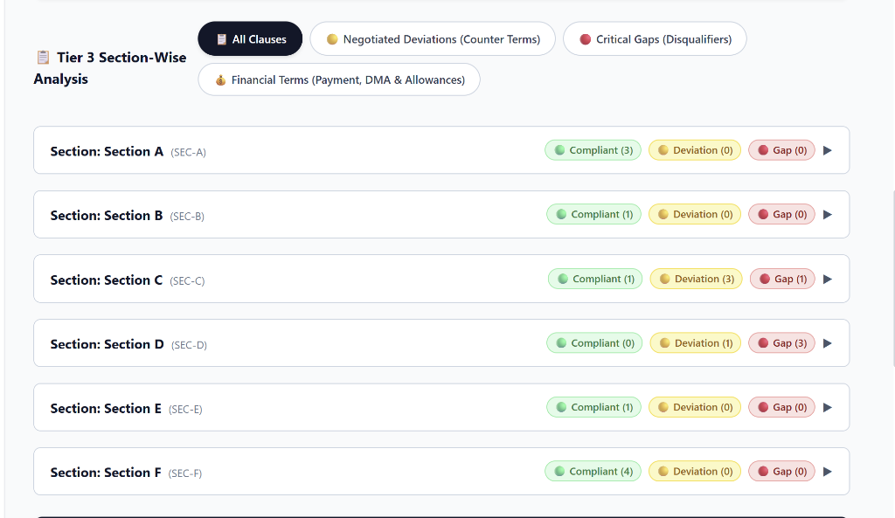
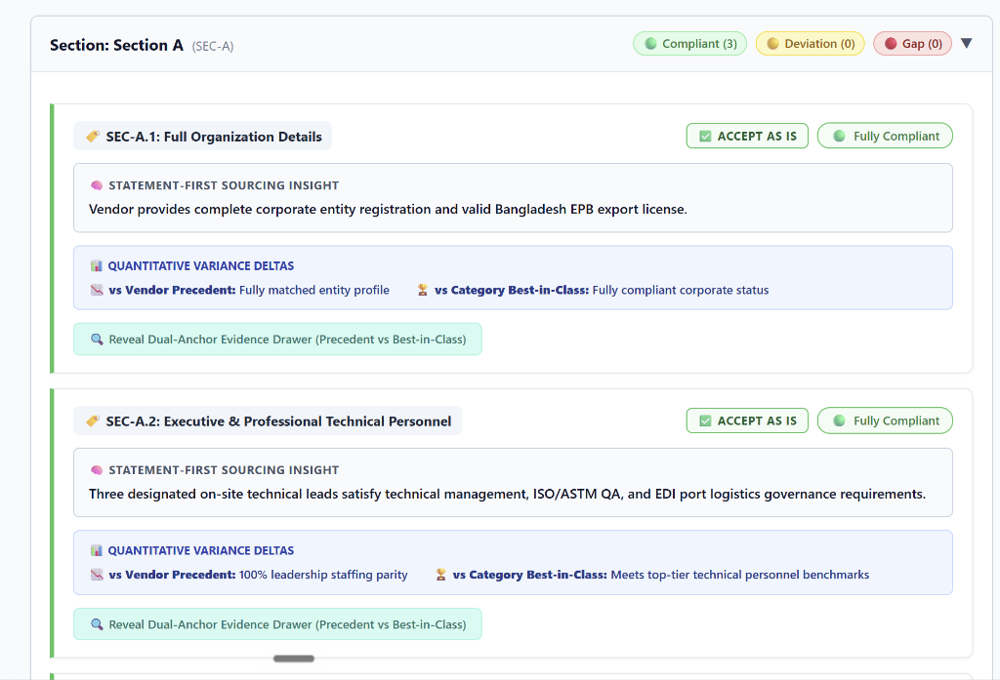
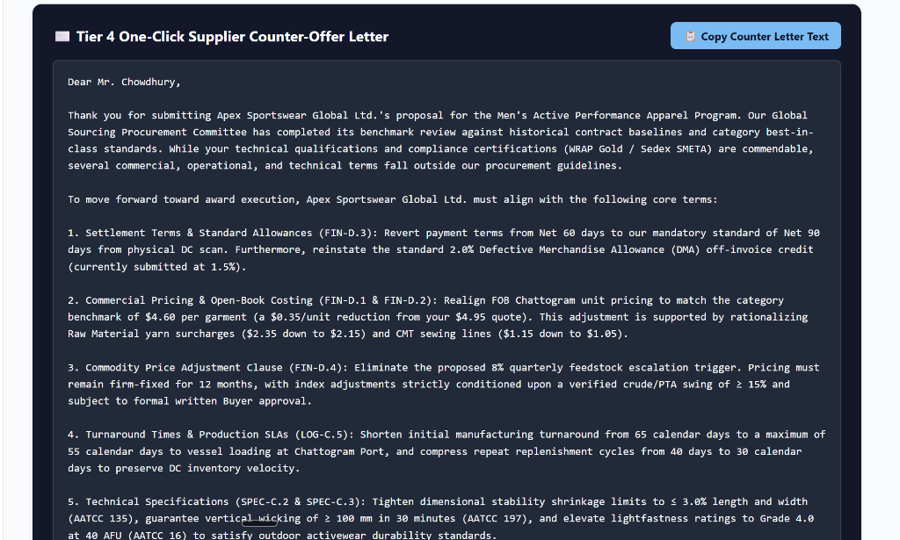

# 🛒 Walmart Sourcing & Procurement Intelligence Platform

[](https://www.python.org/)
[](https://fastapi.tiangolo.com/)
[](https://react.dev/)
[](https://www.typescriptlang.org/)
[](https://www.docker.com/)
[](https://github.com/pgvector/pgvector)
[](https://github.com/DS4SD/docling)
[](https://ai.google.dev/)

An enterprise-grade **Retrieval-Augmented Generation (RAG)** platform designed specifically for **Walmart Category Managers**, sourcing officers, and procurement teams. The system automates vendor proposal reviews, service level agreement (SLA) verification, precedent contract benchmarking, and priority negotiation battlecard generation—reducing contract evaluation cycles from days to under **60 seconds** with 100% grounded clause traceability.

---

## ⚠️ Disclaimer & Confidentiality Notice

> [!IMPORTANT]
> **Independent Portfolio Project**: This repository is an independent technical portfolio demonstration project. It is **not** an officially sponsored, endorsed, or affiliated product of Walmart Inc., its subsidiaries, or any named vendor.
> 
> **100% Synthetic Mock Data**: All contract documents, vendor proposals (e.g., Apex Sportswear Global Ltd.), Service Level Agreements (SLAs), pricing sheets, and evaluation outputs contained within this repository are **entirely synthetic mock data** engineered solely for technical demonstration and portfolio evaluation purposes.
> 
> **Zero Proprietary Data**: This repository contains **no proprietary Walmart Master Sourcing Agreements (MSAs)**, actual supplier pricing, trade secrets, confidential business data, or non-public internal information of any kind.


---

## 🌟 Key Capabilities

- **Layout-Aware Contract Parsing**: Utilizes **IBM Docling (`DocumentConverter`)** to parse incoming PDFs, Word documents (`.docx`), and HTML contracts into structural Markdown trees while preserving section headings, table boundaries, and page numbers.
- **Tier 1 Executive Scorecard**: Generates weighted contract compatibility scores (0–100%) alongside visual status pills (`🟢 Compliant`, `🟡 Deviation`, `🔴 Gap`).
- **Tier 2 Priority Negotiation Battlecard**: Ranks high-risk vendor contract deviations by priority (#1, #2...) featuring explicit category tags, variance summaries, and interactive collapsible drawers (`📜 View Citation & Precedent Benchmark ▼`).
- **Tier 3 Section-Wise Analysis (`📋 Tier 3 Section-Wise Analysis`)**: Accordion view default-collapsed (`open = false`) organizing clause-by-clause baseline vs proposal comparisons.
- **Hybrid Vector & Precedent Store**: Uses **PostgreSQL 16 + `pgvector`** storing 768-dimensional dense vector embeddings (`text-embedding-004`) alongside relational JSONB metadata and IVFFlat cosine similarity indexes.
- **Context-Grounded Sourcing Chatbot**: Interactive conversational interface equipped with RAG retrieval over indexed category precedents and master SLAs.
- **6-Tier Anti-Hallucination Framework**: Enforces deterministic low-temperature decoding ($T=0.2$), dual-anchor citation mandates, Pydantic JSON schema validation, and raw context window injection.

---

## 📂 Repository Structure

```text
walmart-project/
├── docker-compose.yml            # Multi-container setup (Backend, Frontend, DB)
├── Dockerfile                    # Python 3.11 FastAPI backend container
├── Makefile                      # Development shortcuts (build, test, run, clean)
├── README.md                     # Main repository documentation & guide
├── pyproject.toml / requirements.txt
├── .env.example                  # Environment template
│
├── src/                          # Python Backend & RAG Engine
│   ├── config.py                 # Application settings & Gemini API keys
│   ├── logging_config.py         # Structured JSON logging
│   ├── rag_api/                  # FastAPI Application
│   │   ├── app.py                # FastAPI app initialization & CORS setup
│   │   ├── auth.py               # JWT authentication & session management
│   │   ├── dependencies.py       # Database session dependency injection
│   │   └── routes/               # API Router endpoints
│   │       ├── auth.py           # Login & user management
│   │       ├── chat.py           # Contextual RAG chatbot endpoint
│   │       ├── documents.py      # Contract upload & parsing endpoints
│   │       ├── gaps.py           # Gap analysis & battlecard generator
│   │       ├── knowledge_base.py # Precedent document management
│   │       └── settings.py       # Model & prompt runtime configuration
│   └── rag_ingest/               # Ingestion & Vector Storage Pipeline
│       ├── ingest.py             # IBM Docling (DocumentConverter) integration
│       ├── chunking.py           # Layout-aware section & criteria chunker
│       ├── extractor.py          # Metadata & clause extraction logic
│       ├── models.py             # Pydantic data schemas
│       ├── pipeline.py           # End-to-end ingestion orchestrator
│       ├── store.py              # PostgreSQL + pgvector store & search
│       ├── llm/                  # Google Gemini API provider integrations
│       └── prompts/              # Production system prompts
│           ├── gap_analysis_prompt.py
│           ├── ingestion_prompt.py
│           └── chat_prompt.py
│
├── frontend/                     # React 18 + TypeScript + Tailwind CSS Frontend
│   ├── src/
│   │   ├── api/                  # Axios HTTP client & API typings
│   │   ├── components/           # UI Components
│   │   │   ├── GapAnalysisDashboard.tsx  # Tier 1, 2, 3 Dashboard
│   │   │   ├── ChatPanel.tsx             # Interactive RAG Assistant
│   │   │   ├── KnowledgeBaseManager.tsx  # Category precedent manager
│   │   │   ├── PdfUpload.tsx             # Proposal upload modal
│   │   │   └── Login.tsx                 # Authentication screen
│   │   └── context/                  # AuthContext & global state
│   ├── package.json
│   └── tailwind.config.js
│
├── docs/                         # System Documentation & Reports
│   ├── ARCHITECTURE.md           # Deep dive system architecture & data flows
│   ├── SETUP.md                  # Detailed environment setup & troubleshooting
│   ├── API_SPECIFICATION.md      # REST API endpoints & request/response schemas
│   ├── Walmart_Sourcing_Intelligence_Platform_Master_Report.pdf# Main Executive Summary PDF Report
│   └── reports/                  # Generated PDF reports & client deliverables
│       ├── Walmart_Sourcing_Intelligence_Platform_Master_Report.pdf
│       ├── Strategic_Sourcing_Intelligence_Platform_Documentation.pdf
│       └── Client_Handoff_Report.pdf
│
├── sample_data/                  # Clean Procurement Contracts for Testing
│   ├── Walmart_Master_Procurement_SLA_Baseline.docx
│   ├── Apex_Logistics_Vendor_Proposal_Compliant.docx
│   └── GlobalFreight_Vendor_Proposal_HighRiskGaps.docx
│
├── scripts/                      # Utility Scripts
│   └── generate_pdf_summary.py   # ReportLab PDF documentation builder
│
└── tests/                        # Pytest Automated Test Suite
    ├── test_gemini_provider.py
    ├── test_ingest.py
    └── test_store.py
```

---

## 🚀 Quick Start Guide

### Prerequisites
- [Docker Desktop](https://www.docker.com/products/docker-desktop/) (v24.0+)
- [Git](https://git-scm.com/)
- A Google Gemini API Key ([Get Key Here](https://aistudio.google.com/))

### 1. Clone Repository & Configure Environment
```bash
git clone https://github.com/walmart-sourcing/walmart-project.git
cd walmart-project

# Copy environment template
cp .env.example .env
```

Edit `.env` and set your `GEMINI_API_KEY`:
```env
GEMINI_API_KEY=your_actual_gemini_api_key_here
POSTGRES_USER=postgres
POSTGRES_PASSWORD=postgres
POSTGRES_DB=rag_db
POSTGRES_HOST=db
POSTGRES_PORT=5432
LLM_MODEL=gemini-2.5-flash
EMBEDDING_MODEL=text-embedding-004
```

### 2. Launch Services with Docker Compose
```bash
docker compose up -d --build
```

### 3. Verify Container Health
```bash
docker compose ps
```
- **Frontend App**: `http://localhost:3000`
- **Backend REST API**: `http://localhost:8000/docs` (Swagger UI)
- **PostgreSQL Vector DB**: `localhost:5433`

---

## 🔍 Live Database Inspection

To inspect vector embeddings and chunked contracts stored in `pgvector`:
```bash
docker exec -it rag-db-1 psql -U postgres -d rag_db -c "SELECT chunk_id, chunk_type, source_path, substring(content from 1 for 60) FROM document_chunks LIMIT 5;"
```

---


---

## 📊 Platform Output & UI Preview

Here is a visual walkthrough of the platform output generated during a vendor contract comparison and gap analysis:

### 1. Executive Scorecard (Tier 1) & Priority Battlecard (Tier 2)
Displays the weighted contract compatibility score (81.5/100 PTS) alongside risk callouts, followed by ranked priority negotiation items with collapsible citation drawers.



### 2. Section-Wise Analysis & Clause Details (Tier 3)
Section accordions default to collapsed (`open = false`) showing summary status count pills (`🟢 Compliant`, `🟡 Deviation`, `🔴 Gap`) across section categories (`SEC-A` through `SEC-F`).



Expanding any section reveals clause-by-clause evaluation cards (`SEC-A.1`, `SEC-A.2`...), featuring statement-first sourcing insights, quantitative variance deltas vs. category best-in-class, and dual-anchor precedent drawers.



### 3. Supplier Counter-Offer Letter Generation
Auto-generates a formal counter-proposal letter ready to copy and send to vendor representatives.




---

## 📄 Documentation & Reports

Exhaustive technical PDF and Markdown documentation files are located in the `docs/` folder:
- 📄 [Walmart Project Summary PDF](docs/reports/Walmart_Sourcing_Intelligence_Platform_Master_Report.pdf)
- 🏗️ [Architecture Overview](docs/ARCHITECTURE.md)
- 🔌 [API Specification](docs/API_SPECIFICATION.md)
- 🛠️ [Setup & Operations](docs/SETUP.md)

---